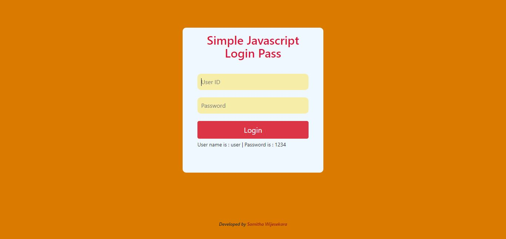

# simple-login-pass-with-javascript
Simple login which is check the user id, password &amp; then redirect to the login page. (By javascript)

💻😍 Online Demo : https://simple-login-pass-with-javascript.netlify.app/

### What is this project?
This is a project which is like login page. Simply I created a login form. When user want to redirecting to some specific web page he/she should type the correct user id & password then he/she can display that specific web page.

### What are the programming languages used for this?
This is simple web application. I have used html, css & javascript to build up this form.

### How can use this project?
In default I have save user id as a "user" & password as a "1234" on javascript. Therefor you can type this user id and password you can log in to the specific web page.

**UserID  - user**

**Password - 1234**

if you type correct User ID & Password you get the alert "Login Successfully..!!"

Onece you type incorrect User ID & Password then click the login button you get the alert "You have left 2 attempt". You only have **3 attempts** to login.

**If you miss the these three attempts, form input fields & button automatically disable.**

